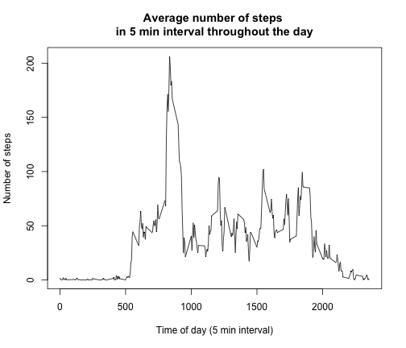

# Reproducible Research: PA1

## Loading and preprocessing the data
First unzip the activity file and read the data into a dataframe.

```r
unzip("activity.zip")
df <- read.csv("activity.csv")
```

We will use data.table to manipulate the data

```r
library(data.table)
DT <- as.data.table(df)
```

## What is mean total number of steps taken per day?
First generate a histogram of the total number of steps taken per day.

```r
dt1 <- DT[,sum(steps), by=date]
hist(dt1$V1, main=paste("Histogram of\nTotal number of",
                        "steps taken per day"), 
     xlab="Number of steps")
```

 


To get the mean and median:

```r
mean(dt1$V1, na.rm=TRUE); median(dt1$V1, na.rm=TRUE)
```

```
## [1] 10766.19
```

```
## [1] 10765
```

The mean is 10766.19 steps and median is 10765.

## What is the average daily activity pattern?
To get the daily pattern activity, we average the number of steps across days, grouped by the time of day (interval). 

```r
dt2 <- DT[,mean(steps, na.rm=TRUE), by=interval]
plot(dt2$V1 ~ dt2$interval, type="l", 
     main=paste("Average number of steps",
                "\nin 5 min interval throughout the day"), 
     ylab="Number of steps", 
     xlab="Time of day (5 min interval)")
```

 

To find the interval with the maximum number of steps:

```r
dt2[V1 == max(dt2$V1)]
```

```
##    interval       V1
## 1:      835 206.1698
```

The interval with the maximum number of steps is the 835 interval.

## Imputing missing values
The number of rows with NAs can be found using summary:

```r
summary(DT$steps)
```

```
##    Min. 1st Qu.  Median    Mean 3rd Qu.    Max.    NA's 
##    0.00    0.00    0.00   37.38   12.00  806.00    2304
```

There are 2304 rows with NA. For each interval with NA, we will replace it by the average number of steps for that interval so that it won't affect the average.

We first compute the average number of steps for each interval using a new data.table **DT2**


```r
DT2 <- copy(DT)
DT2[,  impSteps := ifelse(is.na(steps), 
                          dt2[interval==interval, V1], 
                          steps)]
```

Now create a histogram of the imputed steps

```r
dt3 <- DT2[,sum(impSteps), by=date]
hist(dt3$V1, main=paste("Histogram of\nTotal number of",
                        "(imputed) steps"), 
     xlab="Number of (imputed) steps")
```

 

To find the imputed mean and median:

```r
mean(dt3$V1); median(dt3$V1)
```

```
## [1] 10766.19
```

```
## [1] 10766.19
```

After imputing, the mean and median are both 10766.19 steps. The mean is unchanged since we have replaced each NA by the average for that interval across the days. The mean of the total steps for each day is not affected eventhough the total number of steps has increased (numerator) the denominator is also increased accordingly. 

The median is now equal 10766.19 (the original mean) since the the days that were NAs are not replaced by the 10766.19, in other words there are many more days with 10766.19 steps, shifting the median value as well.

Imputing only affects the days with missing data (8 such days) and has no effect on the other days. 


## Are there differences in activity patterns between weekdays and weekends?

We create a new data.table with a day-of-week column

```r
DT3 <- copy(DT2)
DT3[, 
    dayOfWeek := {
       wkday <- weekdays(as.Date(date, "%Y-%m-%d"));
                  ifelse((wkday == "Sunday" | wkday =="Saturday"), "weekend", "weekday") }  ]
```

We make a 2 panel plots to compare weekdays and weekends activities

```r
dt4wkDay <- DT3[dayOfWeek =="weekday",mean(impSteps), by=interval]
dt4wkEnd <- DT3[dayOfWeek =="weekend",mean(impSteps), by=interval]
par(mfrow=c(2,1))
plot(dt4wkDay$interval, dt4wkDay$V1, ylab="Ave no. of steps", 
     main="Weekdays",
     xlab="Interval", type="l", col="blue")
plot(dt4wkEnd$interval, dt4wkEnd$V1, ylab="Ave no. of steps",
     main="Weekends",
     xlab="Interval", type="l", col="red")
```

 

From the 2 graphs it clear that during the weekdays, there are more walkings during the early part of the day (e.g, to work) and less walking during office hours, whereas during weekends the walkings start later (rise later) and there are more walkings throughout the day (e.g., shoppings and running errands).

The comparison is clearer by overlaying the two graphs.

```r
plot(dt4wkDay$interval, dt4wkDay$V1 ,  type="n", 
     main=paste("Average number of steps",
                "\nin 5 min interval"), 
     ylab="Number of steps", 
     xlab="Time of day")
lines(dt4wkDay$interval, dt4wkDay$V1, col="blue")
lines(dt4wkEnd$interval, dt4wkEnd$V1, col="red")
legend("topright", 
       c("weekday", "weekend"), 
       lty=c(1,1),  col=c("blue", "red"))
```

 


